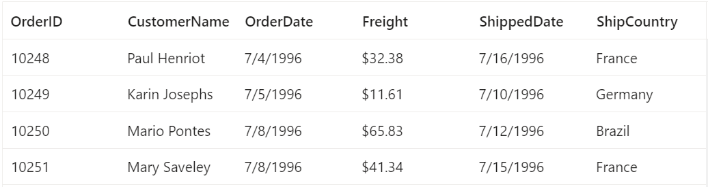
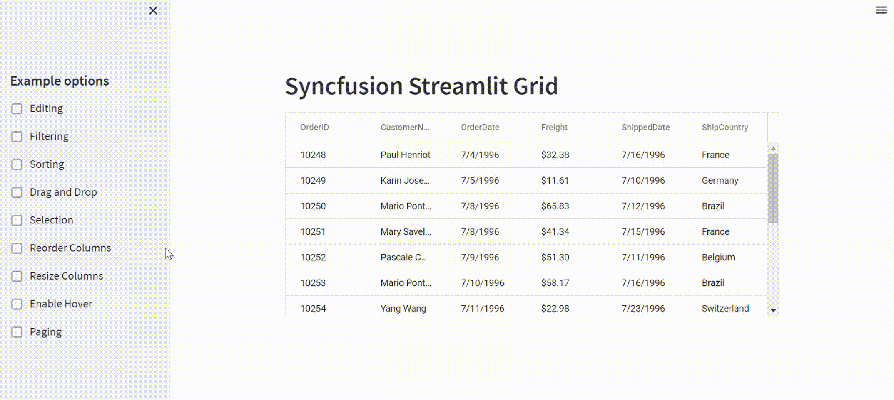

# Getting started with Syncfusion Grid component with Streamlit Python Framework

This article provides a step-by-step guide for setting up a [Streamlit](https://streamlit.io/) project with a Python environment and integrating the Syncfusion Grid components.

The `Streamlit` is a free and open-source framework that enables quick development and sharing of visually appealing web applications for machine learning and data science.

## Set up the Streamlit project environment

A recommended approach for beginning with Streamlit framework is to create a Python environment with [venv](https://docs.python.org/3/library/venv.html). To create a new Python environment, use the following command.

```bash
python -m venv my-project
```

Using the above command will create a Python virtual environment.

Upon completing the aforementioned step to create **my-project**, run the following command to install Streamlit:

```bash
cd my-project
pip install streamlit
```

Now that **my-project** is ready to run with default settings, let's add Syncfusion Grid components to the project.

## Add Syncfusion Grid package

Syncfusion Grid component package is available at [pypi.org](https://pypi.org/project/ej2-streamlit-grids/). To use the Syncfusion Grid component in the project, install the corresponding pip package.

```sh
pip install ej2-streamlit-grids
```

## Add Syncfusion Grid component

Follow the below steps to add the Syncfusion Grid component to the Streamlit Python project:

  1. First, create a Python file named **demo.py** and import the Grid component into the  **demo.py** file.

```py
from ej2_streamlit_grids import GridComponent, GridProps
```
  2. Define the Grid component with the `GridProps` and `dataset` instance to the `GridComponent` function.

```py
data = pd.read_csv('dataset.csv')
props = GridProps(data)

GridComponent(props)
```

  3. Declare the values for the **dataset.csv** file.

```sh
OrderID, CustomerName, OrderDate, Freight, ShippedDate, ShipCountry
10248, Paul Henriot, 7/4/1996, $32.38, 7/16/1996, France
10249, Karin Josephs, 7/5/1996, $11.61, 7/10/1996, Germany
10250, Mario Pontes, 7/8/1996, $65.83, 7/12/1996, Brazil
10251, Mary Saveley, 7/8/1996, $41.34, 7/15/1996, France
```

  4. Syncfusion components come with pre-defined themes that are built-in. To learn more about these themes, you can refer to the [themes topic](https://ej2.syncfusion.com/react/documentation/appearance/theme/). By default, the Syncfusion Streamlit Grid component uses the `Material` theme, but users have the ability to change the theme of the Grid component at the application level. The Grid component in this article is using the `Fluent` theme, which is referenced using the code snippet below.

```py
props.theme = 'https://cdn.syncfusion.com/ej2/21.1.35/fluent.css'
```

Here is the summarized code for the above steps in the **demo.py** file:

```py
from ej2_streamlit_grids import GridComponent, GridProps
import pandas as pd

data = pd.read_csv('dataset.csv')
props = GridProps(data)
props.theme = 'https://cdn.syncfusion.com/ej2/21.1.35/fluent.css'

GridComponent(props)
```

## Run the project

To run the project, use the following command:

```sh
streamlit run demo.py
```

The output will appear as follows:



## Grid features demo

The Grid component is rendered along with some additional features in the **demo.py** file located in the **demos** folder. The resulting output with these features will be displayed as depicted below:

